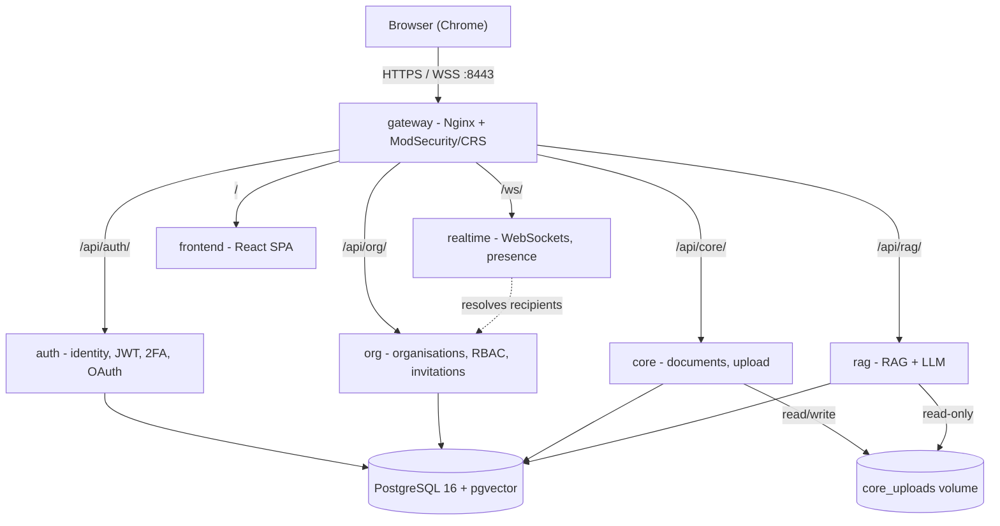
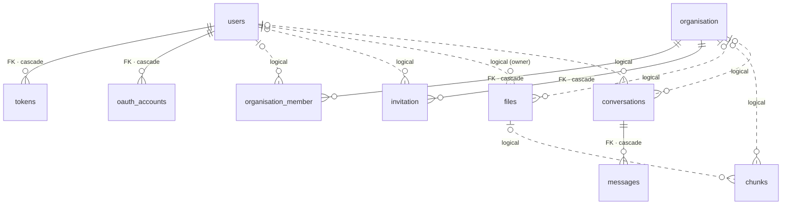

*This project has been created as part of the 42 curriculum by jmattion, ysimonne, kkraft, thsykas.*

# Keepr

    

**A secure team document vault with an AI assistant that answers only from the documents you are allowed to read.**

[Description](#1-description) · [Instructions](#2-instructions) · [Team](#3-team-information) ·
[Project management](#4-project-management) · [Stack](#5-technical-stack) · [Architecture](#6-architecture) ·
[Database](#7-database-schema) · [Features](#8-features-list) · [Modules](#9-modules) ·
[Contributions](#10-individual-contributions) · [Compliance](#11-mandatory-requirements-compliance) ·
[Limitations](#12-known-limitations) · [Resources](#13-resources)

---

## 1. Description

**Goal.** Most document tools force a choice between *searchable* and *access-controlled*: put an AI
assistant on a shared drive and it will happily quote a file the reader was never meant to open. Keepr
makes retrieval and permissions the same mechanism: documents, their embeddings and the roles guarding
them all share one `organisation_id` scope, so the assistant cannot cite a document outside the asker's
organisation.

**Overview.** A user signs up (email + password, optionally with TOTP 2FA) or via Google / 42, creates an
**organisation**, and invites colleagues by email with a role: **admin**, **editor** or **reader**.
Members upload documents, and the role decides who may add, edit, delete or only read them. Every upload is
chunked, embedded and indexed automatically, so it is immediately queryable by the AI assistant. A live
feed shows who is doing what, and a dashboard summarises what the organisation stores.

**Key features** — organisations with **RBAC** (admin / editor / reader) enforced server-side, plus an
email invitation flow · **secure authentication** (bcrypt salted hashes, JWT with rotating refresh
tokens, TOTP 2FA, OAuth 2.0 via Google and 42) · **document management** (drag-and-drop upload,
pagination, in-browser preview, download, edit, delete — scoped by organisation, gated by role) · an
**AI assistant** answering from those documents, streamed token by token with clickable `[n]` citations
and persisted conversations · a **live audit feed** over WebSocket with an online indicator ·
an **analytics dashboard** (KPIs, charts, date presets, auto-refresh, CSV export) · and a **hardened
single entry point** (Nginx + ModSecurity/OWASP CRS in blocking mode, with no backend reachable from the host).

---

## 2. Instructions

### 2.1 Prerequisites

**Docker Engine 20.10+**, **Docker Compose v2** (the `docker compose` plugin syntax), **GNU Make**,
**git** (for `make crs`), **OpenSSL** (for `make certs`), and **Google Chrome** latest stable as the
reference browser. Nothing else is needed on the host — Python 3.12, Node 20, PostgreSQL 16 and Nginx all
live in images. Allow ~6 GB disk and 4 GB RAM: the AI models download on first start and run on CPU. Host
ports **8443** and **8080** must be free.

### 2.2 Configuration (`.env`)

Credentials live in a git-ignored `.env` at the repository root. [`.env.example`](.env.example) is the
committed template — `cp .env.example .env`, then fill it in:

| Variable | Value |
| -------- | ----- |
| `POSTGRES_USER` `POSTGRES_DB` `POSTGRES_PASSWORD` | **Required**, no fallback — services refuse to start without them |
| `SECRET_KEY` | **Required.** JWT signing key, e.g. `openssl rand -hex 32`. Left empty, a random key is generated *per process start*, invalidating all tokens on restart |
| `ALGORITHM` | `HS256` |
| `ACCESS_TOKEN_EXPIRE_MINUTES` `TEMPORARY_TOKEN_EXPIRE_MINUTES` `REFRESH_TOKEN_EXPIRE_DAYS` `OAUTH_EXCHANGE_EXPIRE_SECONDS` | `15` · `5` · `7` · `30` |
| `FRONTEND_URL` | `https://localhost:8443` |
| `GROQ_API_KEY` | For the AI assistant — a key for the OpenAI-compatible LLM provider (comma-separated keys are rotated on rate limits). Without it, everything works except answer generation |
| `GOOGLE_*` / `FT_*` (`CLIENT_ID`, `CLIENT_SECRET`, `REDIRECT_URI`) | Optional. Redirect URIs must be `https://localhost:8443/api/auth/oauth/{google,42}/callback` and match the provider's registration. Left empty, those two buttons are simply disabled |

### 2.3 Run

```bash
make run
```

One command generates the self-signed TLS certificate, clones the OWASP CRS, builds every image, starts
Postgres and waits for its healthcheck, runs `alembic upgrade head` in a dedicated `migrations` container
to create the `vector` extension and all tables, then starts **auth, org, core, rag, realtime, frontend**
and **gateway**.

Open **<https://localhost:8443>** — the certificate is self-signed, so Chrome warns once (*Advanced →
Proceed*). `http://localhost:8080` redirects to HTTPS. First start takes several minutes while images
build and the AI models download. It is ready when `curl -sk https://localhost:8443/api/auth/health` answers
`{"status":"ok","service":"auth"}`.

| Other commands | |
| --- | --- |
| `make up` · `prod` | Start detached · start in the prod profile (built bundle behind Nginx) |
| `make down` · `logs` · `ps` | Stop · follow logs · show state |
| `make clean` · `fclean` | Remove containers and images, keeping · **wiping** the database volume |
| `make migration m="msg"` · `migrate` · `migrate-down` | Generate · apply · roll back a migration |

### 2.4 First steps

Sign up at `/register` → create an organisation (you become its first admin) → invite a colleague by email
from *Admin* with a role → upload a PDF or text file on *Files* → ask a question on *Chat* and click a
`[n]` citation → watch the live feed while a second account uploads a file → enable 2FA on *Profile*.
Each service serves API docs at `/docs`, e.g. <https://localhost:8443/api/core/docs>.

**Detailed documentation** — each component documents itself in depth: [gateway](gateway/README.md) ·
[auth](auth/README.md) · [org](org/README.md) · [core](core/README.md) · [rag](rag/README.md) ·
[realtime](realtime/README.md) · [frontend](frontend/README.md) · [migrations](migrations/README.md) ·
[dev & migration workflow](docs/DEV_DOC.md)

---

## 3. Team Information

A team of **4**, so some members hold several roles: all four are **Developers** — writing code for their
scope, reviewing pull requests, testing and documenting their work — and three additionally hold a lead role.

| Login | Role(s) | Responsibilities |
| ----- | ------- | ---------------- |
| **jmattion** | **Product Owner** + Developer | Owns the product vision and backlog: decided what Keepr is and which modules serve it. Arbitrates scope and priorities, validates completed work before merge, represents the project to evaluators. |
| **ysimonne** | **Scrum Master / PM** + Developer | Facilitates the team: runs the weekly sync, tracks progress and deadlines, keeps communication flowing, clears blockers — especially cross-service dependencies where one member waited on another's endpoint. |
| **kkraft** | **Technical Lead / Architect** + Developer | Owns technical direction: the microservice split, the shared-database-with-one-migration-chain decision, the stack choices, and the layered convention every service follows. Reviews security-critical changes. |
| **thsykas** | Developer | Implements features end to end and reviews teammates' PRs. Owner of the organisations and RBAC domain. |

---

## 4. Project Management

**How the work was divided.** Vertically, **by service** — each member owned a complete domain (data model,
business logic, HTTP surface, documentation) rather than a layer: **kkraft** `auth/`, **thsykas** `org/`,
**ysimonne** `realtime/`, **jmattion** `core/` + `rag/` + `frontend/` + `gateway/`. Ownership is visible in
the git history, where commits cluster per directory per author. This was deliberate: the microservices
module makes a service boundary a real interface, so one owner per service means one person accountable for
honouring that contract, and two people rarely touch the same file. The cost is that integration must be
explicit — which is what the meeting and the PR reviews are for. Contracts were agreed *before*
implementation so members could work in parallel. Where a dependency was not ready, the consumer stubbed it
and swapped in the real call later (see [thsykas' challenge](#104-thsykas--developer)).

**Meetings.** A **weekly synchronisation meeting** facilitated by the Scrum Master: review what shipped,
re-prioritise with the Product Owner, raise blockers. Coordination is asynchronous between.

**Tools and channels.** **Git** for work distribution — one branch per author per topic
(`<author>/<topic>`), 334 commits from all four members. **GitHub Pull Requests** for review and
integration: every change reaches `main` through a PR reviewed by another member. **WhatsApp** as the
team's quick asynchronous channel. **Markdown in the repository** for decision records — a README per
component plus [`docs/`](docs/). Every PR is expected clean: Python checked with `flake8` (PEP 8) and
`mypy`, dependencies pinned by **uv** with a committed `uv.lock`. TypeScript is checked with ESLint and
`tsc --noEmit` in `strict` mode.

---

## 5. Technical Stack

| Layer | Choices |
| ----- | ------- |
| **Frontend** | **React 19** + **TypeScript**, bundled by **Vite** · **Tailwind CSS v4** (styling solution) · react-router-dom 7 · recharts · react-markdown · lucide-react · qrcode |
| **Backend** | **Python 3.12** + **FastAPI** (async) on all five services · Uvicorn · **Pydantic v2** · **SQLAlchemy 2.0** async + asyncpg (ORM) · **Alembic** · httpx · Passlib/bcrypt · PyJWT · PyOTP · sentence-transformers + torch (CPU) · pypdf · **uv** |
| **Database** | **PostgreSQL 16** + **pgvector** |
| **Infrastructure** | **Docker Compose** · **Nginx** (TLS, reverse proxy) · **ModSecurity v3** + **OWASP CRS** (WAF) · Make |

**Why React + TypeScript.** The dashboard is a stateful application, not a set of documents: shared
organisation context, a live WebSocket, a token-by-token answer stream. Components with hooks map onto
that, and `strict` TypeScript propagates the API layer's types into components, so a backend schema change
becomes a compile error rather than a runtime `undefined`.

**Why FastAPI.** Keepr is I/O-bound in three places — services calling each other, streaming tokens from a
remote LLM, holding many idle WebSockets — so an async framework handles it in one process instead of a
thread per connection. It also derives validation and interactive `/docs` from the same Pydantic models the
code uses, keeping five services documented without a separate spec.

**Why PostgreSQL + pgvector.** The domain is relational and those relations must be *enforced*:
`ON DELETE CASCADE` means deleting an organisation cannot orphan its memberships, and multi-statement
operations (create an organisation *and* its first admin) need real transactions. Choosing **pgvector over
a dedicated vector database** shaped the architecture: with Pinecone or Qdrant the embeddings would live
outside the database holding the permissions, making scoping an application-level filter re-applied on
every query path — exactly where a permissions leak hides. With pgvector the embedding is a column on a
table carrying the same `organisation_id` as everything else, so permission-scoped retrieval is an ordinary
`WHERE` clause beside the vector `ORDER BY`. All five services share **one** Postgres and **one** Alembic
chain, because entities genuinely reference each other across service boundaries and a four-person project
cannot absorb distributed transactions — trade-off in [§12](#12-known-limitations).

**Why a single gateway + WAF.** Every service uses `expose`, not `ports`, so none is reachable from the
host — one place to terminate TLS, one place to run the firewall, one origin, so the frontend uses relative
URLs and needs no CORS. ModSecurity + OWASP CRS inspect every request in **blocking** mode at **paranoia
level 2**, rejecting injection, XSS and traversal with `403`. False positives are scoped out narrowly
rather than by weakening rules ([details](gateway/README.md#waf-modsecurity--owasp-crs)). This is
**infrastructure, not a claimed module** — see [§9](#9-modules). All browser traffic (REST, SSE,
WebSockets) is HTTPS, while traffic inside the Docker network is plain, which the subject permits.

**Validation on both sides.** The frontend validates for UX
([`utils/validation.ts`](frontend/src/utils/validation.ts): email format, required fields, password rules
and confirmation). The backend re-validates independently through Pydantic schemas with explicit
constraints, returning `422`. The frontend is never trusted.

---

## 6. Architecture



| Service | Owns | Never does |
| ------- | ---- | ---------- |
| **auth** | Who a user *is*: credentials, JWTs, 2FA secrets, OAuth links | Authorisation — never answers "what may they do?" |
| **org** | Organisations, memberships, roles, invitations. Sole authority on roles | Store documents or decode JWTs itself |
| **core** | Document binaries and metadata, upload and download | Interpret document content |
| **rag** | Chunking, embeddings, retrieval, generation, conversations | Own the documents it indexes |
| **realtime** | Open WebSockets, presence, event fan-out | Persist anything — state is in memory by design |

Services talk over REST internally (`httpx`). **Authentication and role resolution are delegated, never
duplicated:** `org`, `core`, `rag` and `realtime` forward the `Authorization` header to `auth` (`GET /me`)
instead of decoding JWTs, and `realtime` asks `org` who belongs to an organisation to resolve event
recipients — via `/internal/` routes the gateway answers `404` for. **Notifications never block:** `core`
triggers `rag` ingestion and publishes events with `asyncio.create_task` (never awaited, short timeout,
failures logged), so an outage in `rag` or `realtime` cannot fail an upload. **Multi-user safety:** one
`AsyncSession` per request with the *service* layer owning the transaction boundary (repositories `flush`,
services `commit`/`rollback`), so multi-step operations are atomic. Divergence is compensated (a failed
metadata insert deletes the written binary) and ingestion is idempotent.

---

## 7. Database Schema

**10 tables in one PostgreSQL database**, managed by a single Alembic chain in
[`migrations/`](migrations/) — not one per service, because references cross service boundaries. Every model
inherits the shared `Base` in [`shared/database.py`](shared/database.py), and the `migrations` container applies
`alembic upgrade head` on every launch.



Solid lines are **foreign keys enforced by the database** with `ON DELETE CASCADE`. Dotted lines are
**logical references across a service boundary** — indexed integers validated by the owning service, not
database constraints, which is the price of keeping each service the sole writer of its own tables.

| Table | Owner | Key fields and types |
| ----- | ----- | -------------------- |
| **`users`** | auth | `id` int PK · `email` varchar(255) **unique** · `first_name`/`last_name` varchar(255) · `location` varchar null · `avatar_id` int (default `1`) · `hashed_password` text (bcrypt, salted, or the sentinel `"IMPOSSIBLE"` for OAuth-only accounts, which can never match a bcrypt comparison) · `is_2fa_enabled` bool · `secret_2fa` varchar null · `created_at` timestamptz |
| **`tokens`** | auth | `id` int PK · `token` text (opaque `token_urlsafe(32)`, not a JWT) · `user_id` int **FK → users** · `created_at`/`expired_at` timestamptz |
| **`oauth_accounts`** | auth | `id` int PK · `provider` varchar(50) (`google`/`42`) · `provider_user_id` varchar(255) · `user_id` int **FK → users** · `created_at` timestamptz · **unique** (`provider`, `provider_user_id`) |
| **`organisation`** | org | `id` int PK · `name` varchar(255) · `created_at` timestamptz |
| **`organisation_member`** | org | `id` int PK · `org_id` int **FK → organisation** · `user_id` int indexed · `role_id` int (`1` admin / `2` editor / `3` reader) · `email`/`first_name`/`last_name` varchar(255) null, denormalised from auth so member lists render without a call per member |
| **`invitation`** | org | `id` int PK · `org_id` int **FK → organisation**, indexed · `invited_user_id` int indexed · `email` varchar(255) · `first_name`/`last_name` varchar(255) null · `role_id` int · `status` varchar(20) (`pending`/`accepted`/`declined`) · `invited_by` int · `created_at` timestamptz |
| **`files`** | core | `id` int PK · `filepath` varchar(1024) — internal path `org_<id>/<uuid>.<ext>`, **never exposed** · `title` varchar(255) · `filename` varchar(255) (original name, for downloads) · `description` varchar(512) null · `organisation_id` int — **scoping key of every query** · `content_type` varchar(100) · `size_bytes` int · `owner_id` int · `created_at` timestamptz. Binaries live on the `core_uploads` volume, not in the database |
| **`chunks`** | rag | `id` int PK · `file_id` int indexed · `organisation_id` int indexed — scoping key of every retrieval · `chunk_index` int · `content` text · `embedding` **`vector(384)`** (pgvector, normalised) · `created_at` timestamptz |
| **`conversations`** | rag | `id` int PK · `organisation_id` int indexed · `user_id` int indexed (owner) · `title` varchar(255) (from the first question) · `created_at` timestamptz |
| **`messages`** | rag | `id` int PK · `conversation_id` int **FK → conversations**, indexed · `role` varchar(20) (`user`/`assistant`) · `content` text · `sources` jsonb null (cited excerpts) · `created_at` timestamptz |

`organisation_id` is the single scoping key running through `files`, `chunks` and `conversations` — that is
what makes permission-scoped AI retrieval a `WHERE` clause instead of an application filter. Inspect it live
with `docker compose exec postgres psql -U keepr -d keepr -c "\dt"`.

---

## 8. Features List

"Lead" is the member who designed and implemented the feature, per the git history.

**Authentication & identity** — *lead: kkraft*

| Feature | Description |
| ------- | ----------- |
| Sign-up & login | Email/password, bcrypt-hashed and salted. Duplicate email `409`, bad credentials `401` |
| JWT sessions | 15-min access tokens, with refresh tokens **rotated** on use — old row deleted and new one inserted in one transaction, so a refresh token is never valid twice |
| 2FA (TOTP) | Enable → QR code → confirm with a first code. Later logins return a short-lived `2fa_pending` token until verified. Tolerates ±1 time step of drift |
| OAuth 2.0 (Google & 42) | Authorisation-code flow with a CSRF `state` cookie. Resolves: existing link → existing email (links one) → new user. Tokens never appear in a URL — the callback returns a 30-second one-time code exchanged for real tokens |
| Profile & session | `GET /me`, profile update, logout revoking a refresh token, user lookup by email for `org` |

**Organisations & permissions** — *lead: thsykas — invitations: jmattion*

| Feature | Description |
| ------- | ----------- |
| Organisation CRUD | Create (creator becomes first **admin**), read, rename, delete — cascading to members and invitations |
| Membership | Add a member with a role, list members, change a role, remove a member |
| RBAC | Three ordered roles **admin > editor > reader**. `RoleChecker`, a FastAPI dependency, reads `{org_id}` from the path, resolves the caller's role and returns `403` unless allowed. Each guard admits its role *and every stronger one* |
| Invitations | An admin invites by **email**, then `org` resolves it against `auth`, rejecting unknown addresses (`404`), existing members and duplicates (`409`). The invitee lists, accepts (→ membership in one transaction) or declines |
| Internal lookups | `/internal/` routes returning a user's organisations and an org's members, consumed by `realtime`, `404` through the gateway |

**Documents & AI assistant** — *lead: jmattion*

| Feature | Description |
| ------- | ----------- |
| Upload | Multipart streamed to disk in 1 MB chunks (100 MB ceiling). Stored under a random UUID partitioned by organisation, so original filenames never touch the filesystem |
| Listing, download, preview | Paginated newest-first. Binary streamed back with its original filename. In-browser preview of images, PDFs and text |
| Editing & deletion | Title and description only — content is immutable. Deletion removes the record transactionally, then the binary |
| Organisation scoping | A wrong `organisation_id` returns `404`, never `403`, so a file's existence is not leaked |
| Ingestion | Text extracted (PDF via `pypdf`, `text/*` as UTF-8), split into 800-char chunks with 100 overlap, embedded with `paraphrase-multilingual-MiniLM-L12-v2`, stored as `vector(384)`. Idempotent — old chunks deleted first |
| Hybrid retrieval | Query expansion + a HyDE hypothetical answer → vector search per variant → reciprocal rank fusion (`k=60`) → cross-encoder rerank of 20 candidates → top 6 passages |
| Grounded generation | Prompted to answer *only* from the supplied excerpts, citing `[1]`, `[2]`. Says so when nothing relevant is found instead of guessing |
| Streaming & conversations | SSE (`conversation` → `sources` → many `token` → `done`) rendered as Markdown with clickable citations. Conversations persisted and owner-scoped. Older turns summarised and follow-ups rewritten into standalone questions before retrieval |
| Provider resilience | Key pool rotating on `429`, dead-key tracking on `401`/`403`, `Retry-After` honoured, exponential backoff on `5xx` capped at 30 s |

**Realtime** — *lead: ysimonne*

| Feature | Description |
| ------- | ----------- |
| Authenticated WebSocket | `wss://<host>/ws/audit?token=<jwt>`. Token validated against `auth`, socket closed with `1008` on failure |
| Presence registry | In-memory map of user id → their open sockets, so one user across several tabs or devices is fully tracked |
| Event fan-out | `auth.login`/`auth.logout` reach the **admins** of every org the user belongs to, while `file.created`/`updated`/`deleted` reach **all members** of the file's organisation |
| Enrichment | A minimal inbound event gains a UUID, a UTC timestamp, the actor's name and the organisation name before broadcast |
| Client-facing | Live audit log, an online indicator via `GET /ws/connected_friends`, and reconnection with backoff that distinguishes intentional disconnects |

**Analytics, web client & platform** — *lead: jmattion (migrations: kkraft, jmattion, thsykas)*

| Feature | Description |
| ------- | ----------- |
| Analytics dashboard | KPIs, a files-by-category pie and an uploads-over-time line chart, date presets plus custom range, 10-second auto-refresh, CSV export. Aggregation is SQL: MIME types folded into categories, timestamps into 15-min buckets returned as a continuous series |
| Routing & API layer | Public landing/auth/legal pages plus a guarded `/dashboard` tree. `apiFetch` is the only thing that talks to the backend: prefixes `/api`, attaches the token, throws a typed `ApiError`, and on `401` refreshes **once** (deduplicating concurrent refreshes), retries, then falls back to `/login` |
| Org context & role-aware UI | Loads the user's orgs, restores the last selected, exposes role and `isAdmin`/`canWrite`. Actions absent when the role forbids them — and re-checked server-side regardless |
| Profile & validation | Avatar selection from a bundled set (with a default avatar) and location editing. Client-side validation of email, required fields and password rules, re-validated server-side |
| Legal pages | Privacy Policy (`/privacy`) and Terms of Service (`/terms`), linked from the landing footer |
| Platform | Single entry point with no backend port published · WAF blocking at paranoia level 2 · `/api/org/internal/` shielded with `404` · one-command launch · automatic migrations before services start · dev (HMR) and prod (static bundle) profiles · secrets in a git-ignored `.env` |

---

## 9. Modules

**Total claimed: 21 points** — 9 Major (2 pts = 18) + 3 Minor (1 pt = 3).

| # | Module | Category | Weight | Pts | By |
| - | ------ | -------- | ------ | --- | -- |
| 1 | Framework for both frontend and backend | Web | Major | 2 | jmattion (frontend), all four (backend) |
| 2 | Real-time features with WebSockets | Web | Major | 2 | ysimonne |
| 3 | Use an ORM | Web | Minor | 1 | kkraft, thsykas, jmattion |
| 4 | Standard user management & authentication | User Management | Major | 2 | kkraft |
| 5 | Organization system | User Management | Major | 2 | thsykas (orgs, members), jmattion (invitations) |
| 6 | Advanced permissions system | User Management | Major | 2 | thsykas |
| 7 | Two-factor authentication | User Management | Minor | 1 | kkraft |
| 8 | Remote authentication with OAuth 2.0 | User Management | Minor | 1 | kkraft |
| 9 | Complete RAG system | Artificial Intelligence | Major | 2 | jmattion |
| 10 | Complete LLM system interface | Artificial Intelligence | Major | 2 | jmattion |
| 11 | Backend as microservices | DevOps | Major | 2 | all four |
| 12 | Advanced analytics dashboard | Data and Analytics | Major | 2 | jmattion |

**Major 9 × 2 = 18 · Minor 3 × 1 = 3 · Total = 21 points**

The project requires 14, and extras count as bonus, capped at 5. Keepr claims 21 deliberately, so a module a
corrector judges incomplete does not put the project at risk. **No custom "Modules of choice" are claimed.**
**Not claimed:** the gateway runs a hardened ModSecurity/WAF, but the Cybersecurity module requires
ModSecurity **and** HashiCorp Vault. Keepr does not deploy Vault, so the WAF is infrastructure
([§5](#5-technical-stack)).

### Justification and implementation

**1 · Framework, frontend and backend** *(Major)* — Both sides warrant one: a stateful dashboard, and five
services that must share conventions. React 19 + TypeScript with Vite and react-router-dom. FastAPI on all
five services, each layered router → service (transactions) → repository (the only layer emitting SQL).

**2 · Real-time WebSockets** *(Major)* — An audit trail is only useful live, and polling would lag or hammer the
API. Meets the three requirements: *updates across clients* (targeted multi-socket fan-out, recipients from
`org`), *graceful connect/disconnect* (per-socket registration, dead sockets pruned mid-send, `1008` close
on auth failure, client backoff), *efficient broadcasting* (recipients resolved once, no polling).

**3 · ORM** *(Minor)* — Ten tables across five services with a schema that must evolve without breaking
anyone, and hand-written SQL and DDL would drift. SQLAlchemy 2.0 async with `asyncpg` in the typed
`Mapped[...]` style so models are `mypy`-checkable, on one shared `Base`, with Alembic autogenerating
migrations by diffing models against the live database.

**4 · Standard user management** *(Major)* — Keepr is a permissions product, and accounts are its
foundation. Covers all four requirements — users **update their profile** (location, avatar), they pick an
**avatar from a bundled set** with a default when none is chosen, they **see the online status** of the
people they share an organisation with (in Keepr your organisation members *are* your connections, the
product's equivalent of a friends list), and every user has a **profile page**. Underneath: bcrypt salted
hashes, JWT, rotating refresh tokens.

**5 · Organization system** *(Major)* — The unit that owns documents and scopes AI retrieval. Without it
there is nothing for permissions to apply to. Full CRUD (creator becomes first admin, deletion cascades),
adding and removing members, plus an email invitation flow with accept/decline resolved against `auth` —
exceeding the required create/read/update.

**6 · Advanced permissions** *(Major)* — The subject's requirement (different views and actions per role) is
also Keepr's premise: a reader must not modify, and must not reach a document through the AI assistant
either. Three ordered roles on the membership row, and `RoleChecker` resolves the caller's role for the path's
`{org_id}` and raises `403` unless permitted, with `org` as the single authority other services query rather
than reimplement. Full user CRUD within an organisation, role management, and role-differentiated views.

**7 · Two-factor authentication** *(Minor)* — A vault of sensitive files should not fall to one leaked
password. Complete TOTP lifecycle with PyOTP: enrolment generates a secret and an `otpauth://` URI as a QR
code, a first valid code activates it, later logins require one, and it can be disabled. `valid_window=1`
tolerates 30 s of drift.

**8 · OAuth 2.0** *(Minor)* — Removes password creation from onboarding, and 42 sign-in suits this audience.
Authorisation-code flow for Google and 42, CSRF `state` in an `httponly`, `secure`, `samesite=lax` cookie
compared on callback, three-step account resolution, and a 30-second one-time exchange code so long-lived
tokens never appear in a URL.

**9 · Complete RAG system** *(Major)* — What makes Keepr more than a shared drive, and the reason
permissions and retrieval share one scoping key. Covers all three requirements: *large dataset* (every
upload chunked, embedded, stored in pgvector, idempotently), *users ask and get answers* (one-shot or
streaming), *proper retrieval and generation* (the hybrid pipeline in [§8](#8-features-list) feeding a
grounding prompt requiring `[n]` citations). Retrieval is filtered by `organisation_id`, so the assistant
cannot cite a document outside the caller's organisation.

**10 · Complete LLM interface** *(Major)* — A separate concern from retrieval: RAG decides *what context* to
use, while this is the production-grade client turning context into a streamed answer without falling over when
the provider rate-limits, as its own provider-agnostic layer
([`rag/app/services/llm/`](rag/app/services/llm/)). Covers all three requirements: *generates text* (any
OpenAI-compatible provider, also used for query expansion and summarisation), *handles streaming* (provider
stream consumed to `[DONE]`, re-emitted as SSE), *error handling and rate limiting* (`KeyManager` pool
rotating on `429` after sweeping live keys, dead-key marking, `Retry-After`, capped backoff, clear error on
exhaustion instead of hanging).

**11 · Backend as microservices** *(Major)* — Chosen as much for the team as the architecture: with four
people, a service boundary is also a work boundary, letting each member own a deployable unit and merge
without conflicts while forcing interfaces to be explicit. Five FastAPI services, each with a **single
responsibility**, its own Dockerfile, lockfile and README, **loosely coupled with clear interfaces**: no
service reaches into another's tables, they communicate over **REST**, and authentication and role
resolution are delegated to their owners. See [§6](#6-architecture).

**12 · Advanced analytics dashboard** *(Major)* — An admin needs to answer "what is in here, and is it
growing?" without opening every file. Covers all four requirements: *interactive charts* (pie + line,
recharts), *real-time updates* (10-second polling), *export* (CSV), *customisable date ranges and filters*
(presets plus custom, server-side). Aggregation is SQL, so the browser receives a plottable series.

---

## 10. Individual Contributions

Each member owned a service end to end (see [§4](#4-project-management) for the split), and the git history
shows commits from all four across their respective areas.

### 10.1 jmattion — Product Owner + Developer

Defined the product vision, maintained the backlog, prioritised modules, validated work before merge.
Built: **`core`** (chunked streaming upload, UUID storage, paginated metadata CRUD, download,
`404`-not-`403` scoping, analytics aggregation) · **`rag`** — the entire AI assistant (ingestion,
embeddings, the hybrid retrieval pipeline, grounded generation with citations, SSE streaming, conversation
persistence with history summarisation, the resilient LLM client) · **`frontend`** — the whole web client
(routing, the API layer with single-flight token refresh, organisation context and role-aware UI, files with
upload and preview, streaming chat, the analytics dashboard, audit and connections panels, admin, profile
and legal pages) · **`gateway`** (Nginx config, TLS, prefix routing, WebSocket upgrade, ModSecurity/CRS
hardening) · the **invitation** table and lifecycle in `org` plus its UI · and cross-cutting code (shared
`BaseService`, async session, service Dockerfiles, most of `docs/`).

**Challenges.** *(placeholder — to be completed by jmattion)*

### 10.2 ysimonne — Scrum Master / PM + Developer

Ran the weekly sync, tracked progress and deadlines, kept the WhatsApp channel active, unblocked
cross-service dependencies. Built **`realtime` end to end**: the authenticated `/audit` WebSocket ·
`ConnectionManager`, the presence registry · `Dispatcher`, which validates an inbound event against its
per-type requirements, enriches it and routes it · the clients querying `org` for recipients · the
`EventIn`/`EventOut`/`EventType` schemas · the `/internal/events` and `/connected_friends` endpoints · the
service's error handling (`503` on an unreachable `org`, exceptions around the WebSocket loop, dead sockets
pruned mid-broadcast). Also wrote the `realtime` README and docstrings, plus a documentation and
error-handling pass over `org`.

**Challenge — one user, many tabs.** The registry originally held **one socket per user**
(`User.websocket: WebSocket`, assigned with `self._users[user_id] = User(...)` on connect). It passed every
single-tab test and was wrong in a way that only surfaced late: opening a second tab overwrote the entry,
silently dropping the first tab's socket, and because `disconnect(user_id)` did `self._users.pop(user_id)`,
closing *either* tab marked the user offline everywhere — even with a live socket still open. The fix
(commit `f27b563`) made the registry hold a **list** of sockets per user: `connect` appends instead of
replacing, `disconnect(user_id, websocket)` removes one specific socket and deletes the user only when their
last one is gone, and `broadcast_id` iterates every socket, disconnecting individually those that fail
mid-send. The lesson: presence is per **connection**, not per user, and the single-client happy path hid the
bug entirely.

### 10.3 kkraft — Technical Lead / Architect + Developer

Owned technical direction: the five-service split, the shared-database-with-one-Alembic-chain decision, the
stack choices, and the layered convention every service follows. Reviewed security-critical changes. Built
**`auth` end to end**: sign-up and login with bcrypt salted hashes · JWT access tokens and refresh tokens
rotated in one transaction · the four token types and their lifetimes · `/me`, profile update, user lookup by
email · the **full TOTP 2FA lifecycle** (secret and provisioning URI, confirmation by first code, the
`2fa_pending` login path, disabling) · **OAuth 2.0 for Google and 42** (authorisation-code flow, CSRF `state`
validation, three-step account resolution, the one-time exchange code keeping tokens out of URLs) · the
auth data model — `users`, `tokens`, `oauth_accounts` with their cascades and the
`(provider, provider_user_id)` constraint — plus a large share of the shared Alembic setup.

**Challenges.** *(placeholder — to be completed by kkraft)*

### 10.4 thsykas — Developer

Owner of the organisations and RBAC domain, from data model to HTTP surface. Built the **`org` architecture**
(layered structure, FastAPI dependency wiring in `dependancies.py`) · **organisations and membership** (the
`organisation` and `organisation_member` models and migrations, create/delete an organisation, add/remove a
user, change a member's role, the Pydantic schemas) · **RBAC** (the `Role` enum and the `RoleChecker`
dependency resolving the caller's role for the path's `{org_id}` and rejecting insufficient roles with
`403`) · **authentication delegation** (`get_current_user`, forwarding the `Authorization` header to
`auth` over `httpx` and turning upstream failures into proper HTTP responses).

**Challenge — an abstraction built too early.** The first `org` was designed around a **generic CRUD layer**
meant for every service (`crud_service.py`, `permission_service.py`, then a shared `shared/generic_crud.py`
— commits `7b4b5e5`, `e88f12b`), plus a `simulate_auth.py` router faking an authenticated user because
`auth` was being built in parallel. Neither survived the real requirements: RBAC queries were not generic
operations — they needed the caller's role in a *specific* organisation before deciding anything, which the
abstraction had no place for, so every call site worked around it. It was resolved by deleting rather than
extending: `287ef6a` removed the CRUD and permission services and the stub routers in favour of explicit
`OrganisationRepository` / `MemberOrgRepository`, and `52e9722` deleted `shared/generic_crud.py` outright
while replacing the fake authentication with the real `httpx` call to `auth`. The resulting layout — one
explicit repository per aggregate plus a `RoleChecker` dependency — became the convention the other services
follow. The lesson: a shared abstraction is only worth writing once two real call sites agree on what they
need, and a stub for an unfinished dependency has to be designed to be deleted.

---

## 11. Mandatory Requirements Compliance

| Requirement | Where |
| ----------- | ----- |
| Web app with frontend, backend and a database | React SPA · 5 FastAPI services · PostgreSQL 16 — [§6](#6-architecture) |
| Git, clear messages, commits from all members, proper distribution | 334 commits, all four members, branch per author per topic, reviewed PRs — [§4](#4-project-management), [§10](#10-individual-contributions) |
| Containerised deployment, single command | `make run` — [§2.3](#23-run) |
| Compatible with the latest stable Google Chrome | Reference browser. The self-signed certificate needs accepting once |
| No warnings or errors in the browser console | ESLint and `tsc --noEmit` pass clean, and normal use produces no console output. Two `console.error` calls remain on failure paths only — [§12](#12-known-limitations) |
| Accessible Privacy Policy and Terms of Service | `/privacy` and `/terms`, linked from the landing footer — [§8](#8-features-list) |
| Multi-user support, no corruption or race conditions | Session-per-request, service-owned transactions, compensation, idempotent ingestion — [§6](#6-architecture) |
| Clear, responsive frontend usable across devices | Tailwind breakpoints, native interactive elements, `alt` text. Full WCAG 2.1 AA is a separate module and is **not** claimed |
| A CSS framework or styling solution | Tailwind CSS v4 — [§5](#5-technical-stack) |
| Credentials in a git-ignored `.env`, with an `.env.example` | [`.env.example`](.env.example) committed, with `.env` and `.env.*` ignored — [§2.2](#22-configuration-env) |
| Clear database schema with well-defined relations | 10 tables, enforced cascades — [§7](#7-database-schema) |
| Sign-up and secure login, hashed and salted passwords | bcrypt via Passlib — [§8](#8-features-list) |
| Additional authentication methods via modules | 2FA and OAuth 2.0 — modules 7 and 8 — [§9](#9-modules) |
| Inputs validated on frontend **and** backend | `utils/validation.ts` client-side, Pydantic server-side — [§5](#5-technical-stack) |
| HTTPS for every connection from a browser or script | TLS at the gateway for REST, SSE and WebSockets, with `:8080` redirecting — [§5](#5-technical-stack) |
| At least 14 module points | 21 claimed — [§9](#9-modules) |

---

## 12. Known Limitations

- **No automated test suite or CI pipeline** — quality relies on `flake8`, `mypy`, ESLint, `tsc` and PR
  review. The clearest gap.
- **Secrets live in `.env`** — git-ignored but not encrypted. Centralising them in HashiCorp Vault was
  planned and not delivered, which is why the Cybersecurity module is not claimed. The TLS certificate is
  self-signed: local development only.
- **`realtime` cannot be replicated** — the presence registry is in memory in a single process, so two
  instances would split presence and a restart drops all connections. A proper fix needs Redis pub/sub.
- **One database shared by all services** — a deliberate trade-off ([§5](#5-technical-stack)): real foreign
  keys and transactions, at the cost of schema isolation. Cross-service references are validated by the
  owning service, not the database, so a manual `DELETE` in SQL can leave orphans.
- **Avatars are selected from a bundled set**, not uploaded.
- **Ingestion covers PDF and plain text** — other formats upload, download and preview normally but produce
  no chunks. Answer quality depends on an external LLM provider, and inference runs on CPU.
- **A logout only needs a valid refresh token**, not proof the caller owns it.
- **Two `console.error` calls remain** on failure paths
  ([`FilePreview.tsx`](frontend/src/components/FilePreview.tsx),
  [`ChatPage.tsx`](frontend/src/pages/dashboard/ChatPage.tsx)), and there was **no accessibility audit** —
  ARIA usage is minimal and no screen-reader testing was done.

---

## 13. Resources

**Documentation** — [FastAPI](https://fastapi.tiangolo.com/) · [SQLAlchemy 2.0 async](https://docs.sqlalchemy.org/en/20/) · [Alembic](https://alembic.sqlalchemy.org/) · [Pydantic v2](https://docs.pydantic.dev/latest/) · [PostgreSQL 16](https://www.postgresql.org/docs/16/) · [pgvector](https://github.com/pgvector/pgvector) · [React](https://react.dev/) · [Vite](https://vite.dev/) · [Tailwind CSS](https://tailwindcss.com/) · [MDN: SSE](https://developer.mozilla.org/en-US/docs/Web/API/Server-sent_events) and [WebSockets](https://developer.mozilla.org/en-US/docs/Web/API/WebSockets_API) · [Docker Compose](https://docs.docker.com/compose/) · [Nginx](https://nginx.org/en/docs/) · [ModSecurity v3](https://github.com/owasp-modsecurity/ModSecurity/wiki) · [OWASP CRS](https://coreruleset.org/docs/) · [Sentence-Transformers](https://www.sbert.net/) · [uv](https://docs.astral.sh/uv/)

**Standards** — [RFC 6749](https://datatracker.ietf.org/doc/html/rfc6749) (OAuth 2.0) · [RFC 6238](https://datatracker.ietf.org/doc/html/rfc6238) (TOTP) · [RFC 7519](https://datatracker.ietf.org/doc/html/rfc7519) (JWT) · [RFC 6455](https://datatracker.ietf.org/doc/html/rfc6455) (WebSocket) · [OWASP Top Ten](https://owasp.org/www-project-top-ten/) and [Cheat Sheets](https://cheatsheetseries.owasp.org/) (password storage, authentication, file upload) · [Google OAuth](https://developers.google.com/identity/protocols/oauth2/web-server) · [42 API](https://api.intra.42.fr/apidoc)

**Papers** — Lewis et al., *Retrieval-Augmented Generation for Knowledge-Intensive NLP Tasks* (2020) · Gao et al., *Precise Zero-Shot Dense Retrieval without Relevance Labels* (2022, HyDE) · Cormack et al., *Reciprocal Rank Fusion Outperforms Condorcet and Individual Rank Learning Methods* (SIGIR 2009) · Nogueira & Cho, *Passage Re-ranking with BERT* (2019) · [microservices.io](https://microservices.io/patterns/) patterns

### How AI was used

On two kinds of task. Every suggestion was read, understood, adapted and tested by the member responsible
for the code. Nothing was merged that its author could not explain.

**Writing documentation** — the main use. Once a component worked, AI helped turn the implementation into
prose: the eight per-component READMEs ([auth](auth/README.md), [org](org/README.md), [core](core/README.md),
[rag](rag/README.md), [realtime](realtime/README.md), [gateway](gateway/README.md),
[frontend](frontend/README.md), [migrations](migrations/README.md)), the Python docstrings and TypeScript
TSDoc blocks, [`docs/DEV_DOC.md`](docs/DEV_DOC.md) and this README. Most useful for consistency of structure
and tone across documents written by four people. Authors corrected the drafts against the code: generated
documentation states what the code *appears* to do, which is not always what it does.

**Debugging and code review** — a second pair of eyes on non-obvious symptoms, and a review pass before
opening a PR: reading ModSecurity logs to find which CRS rule was `403`-ing a legitimate request and how to
scope the exclusion narrowly instead of weakening the rule set · interpreting Alembic autogenerate output, in
particular that a column rename appears as `drop` + `add` and destroys data unless rewritten by hand · async
SQLAlchemy session and transaction-boundary mistakes · cross-service failures where the wrong service was
reporting the error.

**Where AI was not used.** The product concept, module selection, service decomposition, data model and
security design were the team's decisions, taken in the weekly meeting and recorded in
[`docs/PROJECT_VISION.md`](docs/PROJECT_VISION.md). The rule throughout: AI reduces the cost of explaining
and checking work. It does not decide what to build, and it does not get to own code no one can defend in
evaluation.

---

Built at [42 Nice](https://www.42nice.fr/) by **jmattion**, **ysimonne**, **kkraft** and **thsykas**. The
OWASP Core Rule Set is fetched at build time from
[coreruleset/coreruleset](https://github.com/coreruleset/coreruleset) (Apache 2.0), not vendored here.
